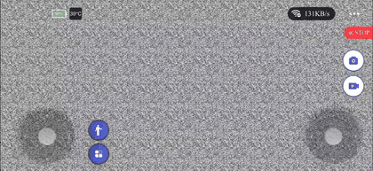
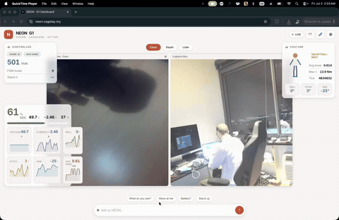
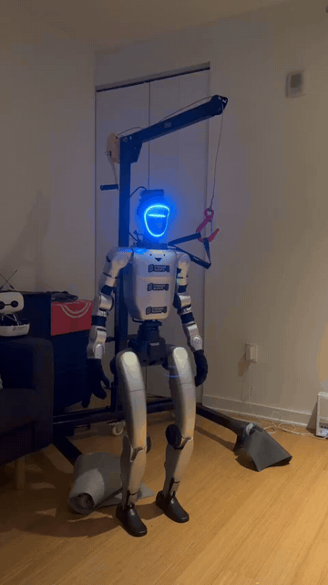
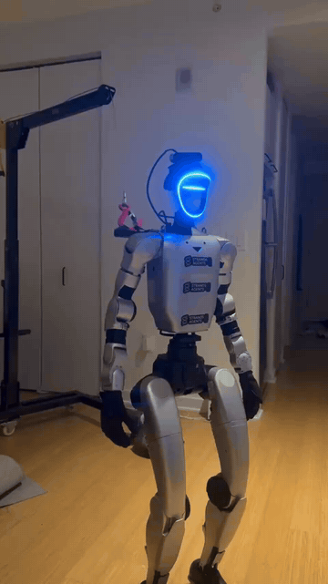

<div align="center">


# `neon`

**Strands agent driving a Unitree G1+** · _vision · language · action · on the edge_

[](#status)
[](https://cagataycali.github.io/neon-the-g1)
[](https://cagataycali.github.io/neon-the-g1/tools/catalog/)
[](LICENSE)

</div>

---

```
🎙 user (voice):  "hey, what can you do?"
🤖 neon (chest):  "I can move, do hand gestures, look around with cameras,
                   read battery, run SLAM... what do you want to try?"
🎙 user (voice):  "wave at me"
    → g1_arm_action(action_id=26)   rc=0 · released
🤖 neon (chest):  *waves*

💬 telegram /state
🤖 mode=ai FSM=501 (Walk) arm_ready=True battery=80% 52V
```

NEON is **one** agent with **four** personas - REPL, voice, telegram, dispatch -
all sharing the same memory, the same toolset (55 robot tools + 12 cross-persona
tools: memory, telegram, voice_say, take_photo, dispatch, phone, voice_control, ...), and the same cross-persona
log. Talk to it via the chest speaker, DM it on Telegram, or `make run` for a REPL -
they all see what the others are doing.

## 🎬 see it move

<table>
<tr>
<td width="50%" align="center">

**🕹 arm the G1 (enable control)**



Switch to walk/control mode in the Unitree app — required before the robot can move.

</td>
<td width="50%" align="center">

**👋 wave (dashboard)**



Trigger a hand gesture straight from the cockpit dashboard.

</td>
</tr>
<tr>
<td width="50%" align="center">

**🚶 walk forward (voice)**



Strands bidirectional speech-to-speech → `g1_move_velocity` → the G1 steps forward.

</td>
<td width="50%" align="center">

**🔙 walk backward (voice)**



Same voice loop, reverse — spoken command drives locomotion in real time.

</td>
</tr>
</table>

> 🎥 Full-resolution MP4s: [arm](docs/assets/how-to-arm-the-g1.mp4) · [wave](docs/assets/neon-wave.mp4) · [forward](docs/assets/move-forward.mp4) · [backward](docs/assets/move-backwards.mp4)

## ⚡ run

```bash
cp .env.example .env && $EDITOR .env   # OPENAI_API_KEY + AWS_BEARER_TOKEN_BEDROCK + TELEGRAM_BOT_TOKEN
make run                               # docker compose up + REPL + auto-start voice
make down                              # stop
```

`make run` boots the agent **and** auto-starts bidirectional voice (`g1_speak`) -
Brio mic → AEC → OpenAI Realtime → G1 chest speaker. Set `NEON_NO_SPEECH=1` to skip.

## 🛰 deploy - full stack in docker, boots on power-on

The whole stack runs as docker containers and starts automatically at boot via
one systemd user unit (`neon-compose.service` → `docker compose up -d`):

```bash
cp .env.example .env && $EDITOR .env      # secrets: AWS_BEARER_TOKEN_BEDROCK, OPENAI_API_KEY, TELEGRAM_BOT_TOKEN, TELEGRAM_DEFAULT_CHAT_ID
make build                                # build the neon image (bakes deps + dashboard UI)
docker compose up -d                      # agent + dashboard + telegram + thinker

# install the boot unit (survives reboot; linger must be on)
cp scripts/systemd/neon-compose.service ~/.config/systemd/user/
loginctl enable-linger "$USER"
systemctl --user daemon-reload && systemctl --user enable --now neon-compose.service
```

Containers (`docker compose up -d`):

| container | role |
|---|---|
| `neon-agent` | REPL agent (base image, DDS on eth0) |
| `neon-dashboard` | UI + cameras + agent chat @ `https://<host>:8080` - **single camera owner** |
| `neon-telegram` | Telegram DM listener → agent replies (waves, photos, robot control) |
| `neon-thinker` | 30s heartbeat → telegram (photo + LED/gesture + status) |

**Camera sharing**: the dashboard is the sole owner of the USB cameras
(V4L2/RealSense are single-open). The thinker + telegram pull frames from the
dashboard's snapshot API via `NEON_CAMERA_PROXY` - so everyone sees the same
feed without fighting the device.

## 🖥 dashboard - passkey-gated cockpit

`https://<host>:8080` (self-signed HTTPS - needed for WebAuthn). First visit
shows **"Seal this robot with a passkey"**: tap → Touch/Face ID → the whole
interface + agent are locked to your device. Later visits unlock with the
passkey. The Configuration drawer lets you pick the colour **scheme**, switch
the **model** (applies to the dashboard chat at once; *Apply to all personas*
recreates the containers through the host-side `neon-ctl`), edit **.env**
(secrets masked, camera-proxy token health + refresh), pick **WiFi**, and manage
**passkeys**. The topbar **voice pill** snoozes the voice listener (15m / 1h /
3h / until unmute) and switches provider / voice / model; the voice agent has the
same switch as the `voice_control` tool. The UI follows the Strands design
language (`docs/dashboard/README.md`, Design and Configuration).

```bash
make auth-status        # show enrolled passkeys / setup state
make auth-clear         # wipe passkeys → reopens setup (auto-refreshes service token)
make token-refresh      # re-sync the camera-proxy service token into .env
```

> Open via a **hostname** (e.g. `https://neon.local:8080` or the Cloudflare
> tunnel) - WebAuthn refuses raw IPs as the relying-party id.

## 📶 networking - always reachable

- **Robot DDS link**: `eth0` = `192.168.123.164` (static; the robot MCU is
  `192.168.123.161`). Never changes, never touched by WiFi tooling.
- **Companion WiFi**: `wlan0` (DHCP). Reach the device at **`ubuntu.local`**
  (mDNS/avahi) from any network - the IP may change, the hostname won't.
- **Auto-fallback hotspot**: if wlan0 loses all known networks, NEON
  auto-connects a low-priority fallback profile **`neon_net`** (create this
  hotspot on your phone, password `1234567890`). A systemd watchdog
  (`neon-wifi-watchdog.timer`, every 60s) force-connects it if NM gets stuck -
  so the robot is always reachable and you can re-pick WiFi from the dashboard.

```bash
make wifi                     # interactive: scan → pick → password
make wifi SSID=x PASS=y       # non-interactive
make wifi-status / wifi-scan  # inspect

# install the wifi watchdog (fallback to neon_net hotspot)
sudo cp scripts/systemd/neon-wifi-watchdog.{service,timer} /etc/systemd/system/
sudo systemctl daemon-reload && sudo systemctl enable --now neon-wifi-watchdog.timer
```

## 🎙 voice + 💬 telegram (lookout-style stack)

Beyond the REPL, NEON has two always-on listeners that share memory + tools
with the REPL agent:

```bash
make voice                             # bidi voice (Brio mic → G1 chest speaker)
make tg                                # telegram bot (multi-turn + /mute /state /battery)
make mute / unmute                     # silence the voice agent live
make voice-push MSG="hi neon"          # inject a briefing for the voice persona to speak
make log-show                          # last 30 cross-persona turns
make ask Q="what's our battery?"       # one-shot REPL query
```

**Cross-persona awareness**: when telegram receives a message, it's pushed to
`voice_bridge` so the voice agent hears about it as a `[BRIEFING]` and can
respond aloud. The voice agent's transcripts go into `agent_log` so the
telegram persona sees what was said. All three personas share `.memory/mem.db`.

## 🧰 toolkit

| bundle | what |
|---|---|
| **motion (FSM-safe)** | `g1_arm_action`, `g1_move_velocity`, `g1_safe_*`, `g1_set_fsm` |
| **state (DDS)** | `g1_get_state`, `g1_battery`, `g1_lidar_*`, `g1_slam_*` |
| **sensing** | `use_camera`, `g1_speak`, `g1_play_wav`, `g1_asr`, `take_photo` (bidi) |
| **cross-persona** | `memory`, `voice_say`, `telegram`, `dispatch`, `agent_log` |
| **escape hatches** | `use_unitree` (any SDK method, AST-verified) · `g1_dds_*` |

55 robot tools + 12 cross-persona tools; the counts on the site are derived from `tools/__init__.py` at build time. [→ catalog](https://cagataycali.github.io/neon-the-g1/tools/catalog/)


## 🧩 strands-robots - sim + VLA policies (two layers, one agent)

NEON fuses **two control layers** via `neon()`:

- **Layer 1 - live DDS** (`tools/`): FSM-gated arms/walk/posture, chest-speaker
  voice, LiDAR/SLAM, memory/telegram/dispatch - real-time control ON the robot.
- **Layer 2 - [strands-robots](https://github.com/strands-labs/robots)**
  `Robot("g1")`: MuJoCo sim (safe default), VLA policies (GR00T/Cosmos/ACT),
  dataset recording + training, Zenoh fleet mesh, and `mode="real"` LeRobot driver.

```python
from strands import Agent
from neon import neon

agent = Agent(tools=neon(mode="sim"))         # 63 tools: DDS + voice + sim
agent("create a world with the g1, run the mock policy for 30 steps")

# real hardware: policy joint-stream + live DDS gestures in one agent
agent = Agent(tools=neon(mode="real", robot_ip="192.168.123.161"))
agent("wave hello, then walk forward 0.3 m")
```

| call | drives NEON via |
|---|---|
| `Robot("g1")` | MuJoCo **simulation** (safe) |
| `Robot("g1", mode="real")` | G1 joints via **LeRobot** driver + a **policy** |
| `tools/` DDS tools | the **live controller** (FSM/arms/walk/voice) |
| `neon()` | **both** |

```bash
pip install -e ".[sim]"          # dev box (sim + policy)
pip install -e ".[all]"          # + voice + lerobot + mesh
neon "stand up and wave"          # CLI wrapper around Agent(tools=neon())
```

→ full design: [`docs/guide/strands-robots.md`](https://cagataycali.github.io/neon-the-g1/guide/strands-robots/)


## 🥽 WebXR Teleop - drive the G1 from a Meta Quest 3

No APK, no sideload. A self-contained WebXR page in the **Quest 3 browser**
tracks your hands / controllers / head **and shows the robot's stereo camera
in your headset** (VR immersive or AR passthrough), streaming poses to a bridge
on the robot which runs IK and drives the arms over DDS.

```bash
make xr-cert                       # self-signed TLS (WebXR needs HTTPS)
make xr-teleop ARM=G1_29 IFACE=eth0   # start bridge (IK→DDS)
make xr-teleop-dry                 # dry-run: stream poses, no robot
# then on the Quest: open https://<robot-ip>:8013/ → "Enter XR & Teleop"
```

Quest 3 → `docs/teleop/index.html` (native WebXR) → **Vuer-compatible**
column-major SE(3) pose stream over WSS → `neon.teleop.xr_bridge` →
`televuer` WORLD→robot transform → `xr_teleoperate` IK → G1 arm DDS.

Pinch (hands) or trigger (controllers) closes the gripper; controller mode adds
thumbstick walking (right-A = stop). Built on
[unitreerobotics/xr_teleoperate](https://github.com/unitreerobotics/xr_teleoperate).

→ full guide: [`docs/guide/webxr-teleop.md`](https://cagataycali.github.io/neon-the-g1/guide/webxr-teleop/)

## 🛡 safety

- walking needs FSM ∈ {501, 801}; gate refuses otherwise
- arm actions auto-release + mutex on `rt/armsdk` (no parallel calls - rc=7400)
- FSM 0 (ZeroTorque) collapses the robot - via `g1_set_fsm(0)`, gantry-only (no dedicated tool)
- `g1_safe_*` posture tools refuse if FSM=None (dead controller - needs physical recovery)

[→ safety model](https://cagataycali.github.io/neon-the-g1/guide/safety/)

## 🧬 extend

```python
# tools/g1_mytool.py - hot-reloadable, no restart needed
from strands import tool
from ._g1_common import ensure_dds, get_loco_client, decode_code

@tool
def g1_mytool(param: int = 0, network_interface: str = "eth0") -> dict:
    """One-line intent the LLM reads."""
    if err := ensure_dds(network_interface):
        return {"status": "error", "content": [{"text": err}]}
    rc = get_loco_client().SomeMethod(param)
    return {"status": "success" if rc == 0 else "error",
            "content": [{"text": f"rc={decode_code(rc)}"}]}
```

Export from `tools/__init__.py`. [→ extending guide](https://cagataycali.github.io/neon-the-g1/guide/extending/)

## 🔌 MCP server — drive NEON from Claude Code / Desktop / Cursor

Expose the **full NEON toolset** (55 FSM-gated G1 robot tools + memory +
telegram + voice_say + take_photo + dispatch) over the Model Context Protocol,
so any MCP client can drive the robot:

```bash
# zero-install via uvx (recommended — no venv needed)
uvx --from neon-the-g1 neon-mcp --safe        # stdio, no walking (recommended)
uvx --from neon-the-g1 neon-mcp --http --port 8022   # HTTP multi-client

# or pip-installed
pip install "neon-the-g1[mcp]"
neon-mcp                       # stdio (Claude Code / Desktop) — default
neon-mcp --safe                # drop locomotion (no walking) — recommended
neon-mcp --http --port 8022    # HTTP multi-client
neon-mcp --no-robot            # cross-persona stack only (no DDS)
```

**Claude Code:** `claude mcp add neon -- uvx --from neon-the-g1 neon-mcp --safe`

**Claude Desktop:**
```json
{"mcpServers": {"neon": {"command": "uvx", "args": ["--from", "neon-the-g1", "neon-mcp", "--safe"]}}}
```

> ⚠️  Without `--safe`, the remote client can invoke locomotion — the robot can
> **walk**. Run on a gantry / clear space and read [`AGENTS.md`](AGENTS.md)
> safety rules first. Same shim technique as
> [strands-transformers](https://github.com/cagataycali/strands-transformers),
> built on [strands-mcp-server](https://github.com/cagataycali/strands-mcp-server).

## 📚 more

- `make help` - full target list (47 verbs)
- [`AGENTS.md`](AGENTS.md) - architecture, FSM/DDS deep-dive, debug logs
- [`docs/voice-architecture.md`](docs/voice-architecture.md) - voice signal chain + tuning
- [`tests/`](tests/) - `make test` runs them all (no robot needed for CI)
- [docs](https://cagataycali.github.io/neon-the-g1) - everything else
- robot SSH @ `192.168.1.175` · DDS controller @ `192.168.123.161` (eth0)

## 🚦 status

| component | status | notes |
|---|---|---|
| 🤖 robot DDS | ✅ live | FSM gating, the robot tools verified against the on-robot SDK |
| 🎙 voice (bidi) | ✅ live | OpenAI Realtime, AEC clean, English + multilingual |
| 💬 telegram | ✅ live | multi-turn + slash commands + photo/voice relay |
| 🦴 SLAM (kiss-icp) | ✅ live | optional, runs on Jetson |
| 🐳 docker stack | ✅ live | librealsense + pyrealsense2 from source on aarch64 |
| 🛰 systemd | ✅ live | `neon-voice` + `neon-telegram` units, journal logs |

## 🙏 built on

[strands-agents](https://github.com/strands-agents) ·
[devduck](https://github.com/cagataycali/devduck) ·
[unitree_sdk2_python](https://github.com/unitreerobotics/unitree_sdk2_python) ·
[CycloneDDS](https://github.com/eclipse-cyclonedds/cyclonedds) ·
[OpenAI Realtime](https://platform.openai.com/docs/guides/realtime)

MIT license.
