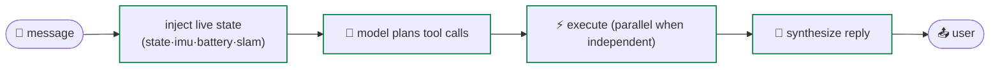
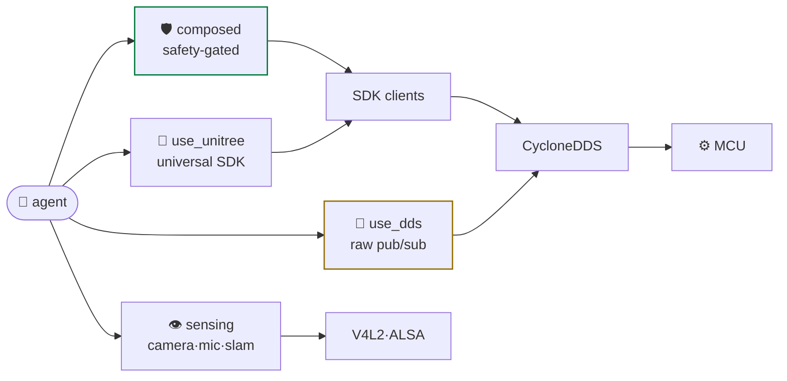
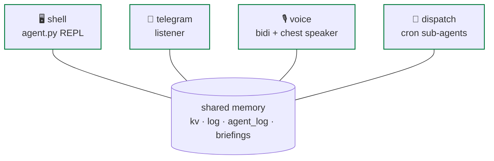

# architecture

<span class="read-badge">⏱ 90s</span>

How `neon` fits inside the G1's runtime.

## physical layout

```
Unitree G1+
├─ Jetson Orin NX  (192.168.123.164)  ← runs neon
│    neon.service → .venv/bin/python agent.py   (or docker compose)
│      Strands loop · G1_ALL_TOOLS (53) · telegram/voice listeners
│    unitree_sdk2_python/  (local clone; pip wheel broken)
│    eth0 · CycloneDDS multicast
▼
└─ Main MCU        (192.168.123.161)  ← Unitree-owned, we never touch
     master_service → sport_mode · loco_service · arm_action · vui/audio
     │ SPI
     ▼  [29 motors · 2 arms · audio · LED · Livox lidar]
```

**Key insight:** neon and `master_service` don't know about each other. neon runs
as a systemd unit (or docker compose) — if it crashes, motor control is
unaffected; if `sport_mode` crashes, neon keeps running.

## the agent loop



Every turn **injects live robot state** into the system prompt — the model
wakes up already knowing FSM, IMU, battery, SLAM pose. All four reads hit
in-memory DDS buffers (< 50 ms), not the motor bus.

## four tool families



1. **Composed** — hand-written, safety-gated (FSM, mutex, clamps)
2. **`use_unitree`** — AST-verified universal dispatch
3. **`use_dds`** — raw escape hatch
4. **Sensing** — outside the SDK (V4L2, whisper, YOLO)

## one agent, four personas



All four share the same tools **and the same memory**. When one persona acts,
the others see it via the unified reasoning log injected into their prompts — so
voice can pick up where telegram left off. See [voice architecture](../voice-architecture.md).

## why DDS not ROS

The MCU speaks CycloneDDS natively. ROS would add a bridge subprocess, an extra
serialization hop, and middleware we don't control. Raw CycloneDDS + the SDK's
typed wrappers is simpler, faster, and matches Unitree's own tools.

See [tool catalog](../tools/catalog.md) · [systemd](../start/systemd.md).
