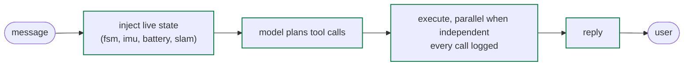
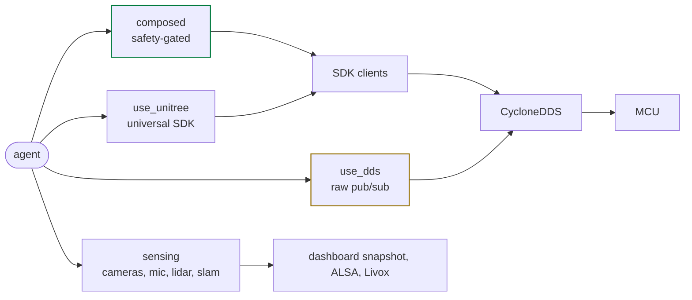
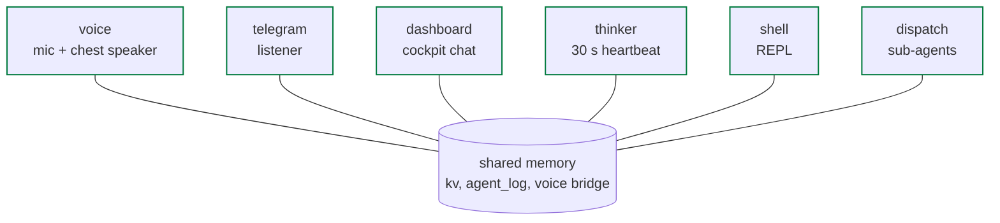

# architecture

<span class="read-badge">90s</span>

How `neon` fits inside the G1's runtime.

## physical layout

```
Unitree G1+
├─ Jetson Orin NX  (192.168.123.164)  runs neon
│    docker compose: neon-agent, neon-dashboard (camera owner), neon-telegram, neon-thinker
│    host units: neon-voice (mic + chest speaker), neon-ctl (restarts for the dashboard)
│    unitree_sdk2_python/ local clone; eth0, CycloneDDS multicast
▼
└─ Main MCU        (192.168.123.161)  Unitree-owned, never touched
     master_service: sport_mode, loco_service, arm_action, vui/audio
     SPI to 29 motors, 2 arms, audio, LEDs, Livox lidar
```

neon and `master_service` do not know about each other: a persona crash leaves
motor control untouched, a `sport_mode` crash leaves neon running. Addresses and
ports on [network](../reference/network.md), the units on [systemd](../start/systemd.md).

## the agent loop



Every turn **injects live robot state** into the system prompt: the model wakes
up knowing FSM, IMU, battery and SLAM pose from in-memory DDS buffers (under
50 ms). Every tool call is wrapped by `tools/tool_log.py` and lands in
`agent_log`, which the next turn of every persona reads.

## four tool families



Composed tools are hand-written and gated (FSM, mutex, clamps, measured
motion); `use_unitree` is AST-verified dispatch over the whole SDK; `use_dds`
is the raw escape hatch; sensing lives outside the SDK (the dashboard's camera
snapshot, the USB mic, kiss-icp on the lidar). Every tool on
[the catalog](../tools/catalog.md).

## one agent, several personas



All of them share the tools **and the memory**: what one persona did (and every
tool it called) is in the log the others read on their next turn, so voice
picks up where Telegram left off. Who carries which tools is on the
[catalog](../tools/catalog.md#who-sees-what); the voice loop on
[voice architecture](../voice-architecture.md).

## why DDS not ROS

The MCU speaks CycloneDDS natively. ROS would add a bridge subprocess, an extra
serialization hop, and middleware we don't control. Raw CycloneDDS + the SDK's
typed wrappers is simpler, faster, and matches Unitree's own tools.

[catalog](../tools/catalog.md){ .md-button } [systemd](../start/systemd.md){ .md-button }
