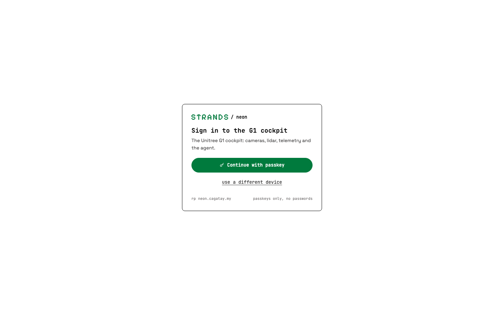
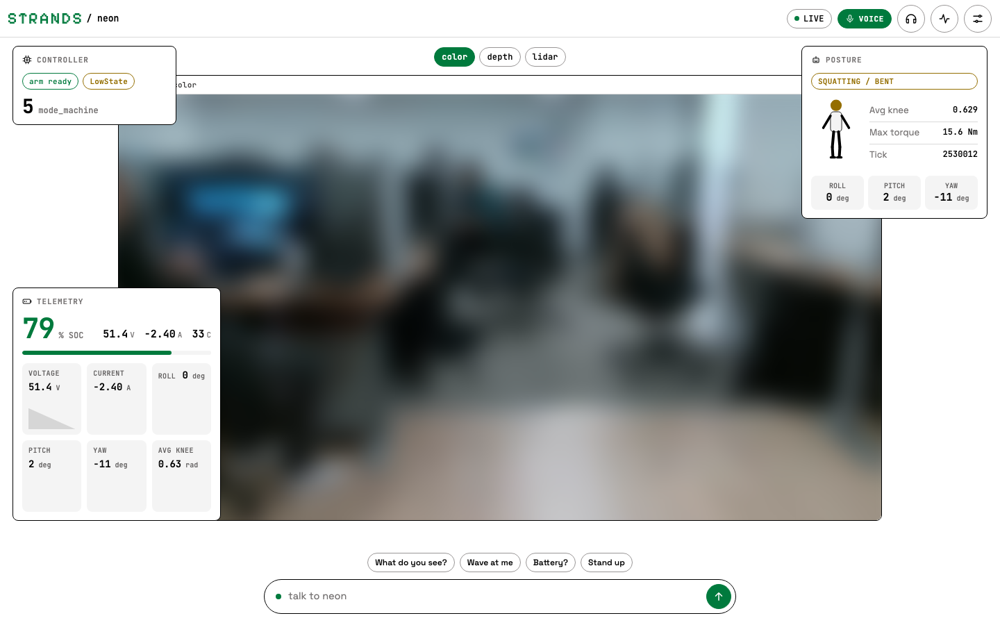
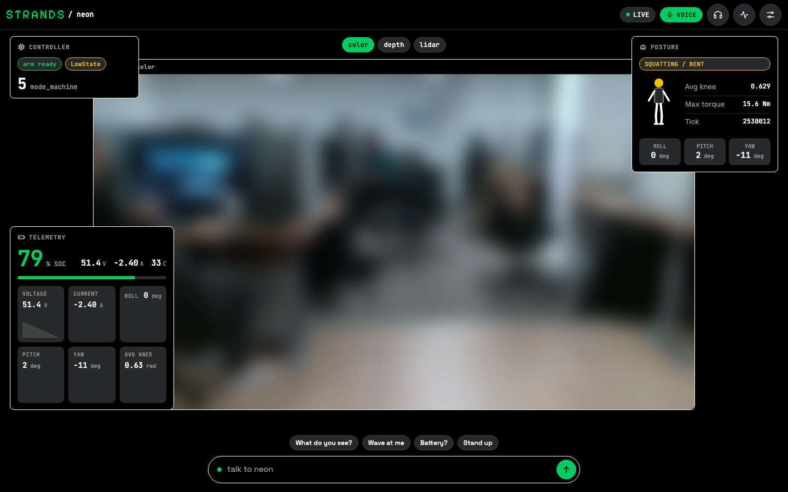
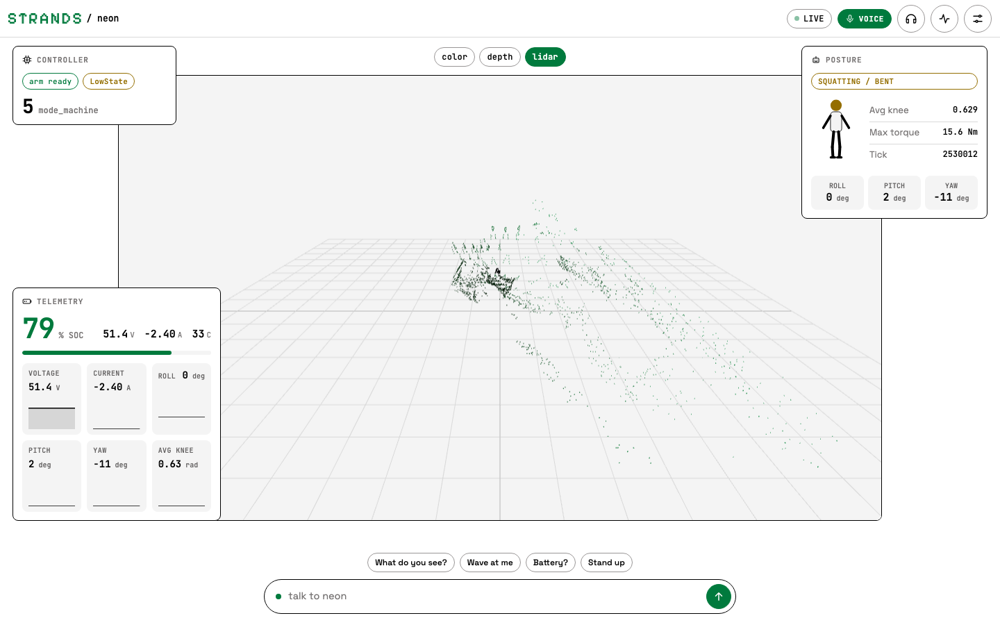
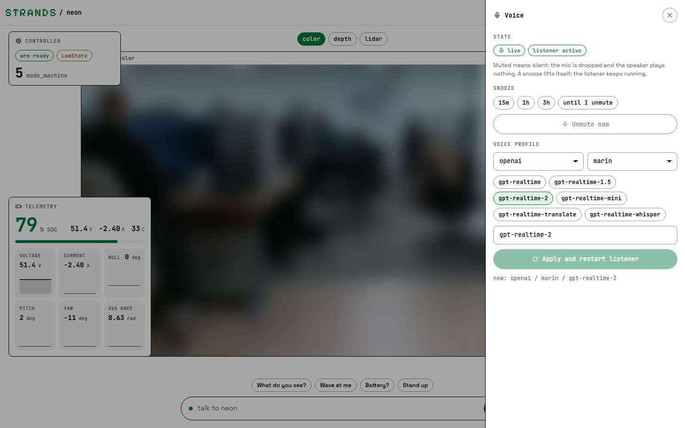
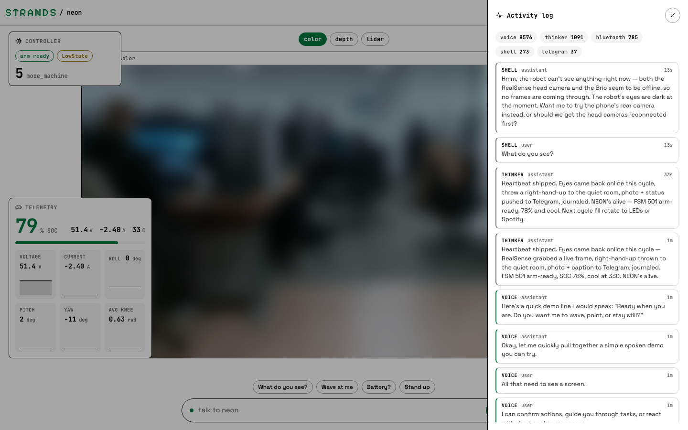
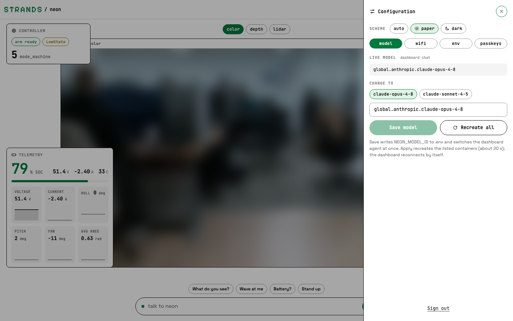
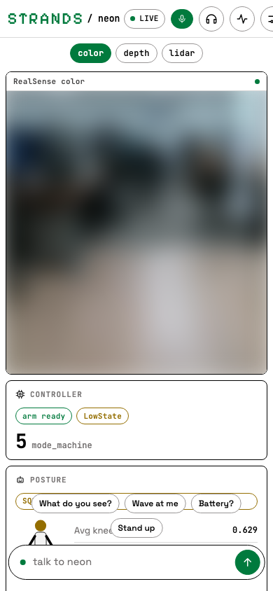
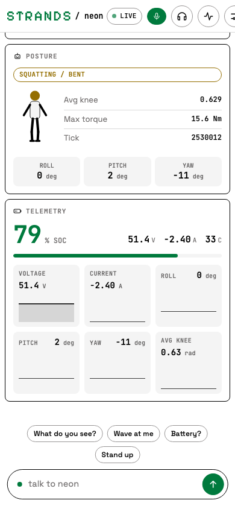

# dashboard

2 min

The cockpit is a FastAPI backend on the Jetson (`docs/dashboard/server.py`, port 8080) serving a React single page app, reached through a Cloudflare tunnel at `https://neon.cagatay.my`. It is the single owner of the USB cameras: every other persona (voice, Telegram, thinker) pulls frames from its snapshot API instead of opening the devices. Screenshots below are from the live robot; the camera frames are blurred because the office has people in it.

## sign in

Passkeys only, no passwords. The first visitor seals the robot with an admin passkey (optionally gated by `NEON_AUTH_BOOTSTRAP_TOKEN`); every later operator is added from Configuration, passkeys, on their own device. Service processes use a long lived signed token from the same store.

<figure class="shot" markdown>
{ loading=lazy }
<figcaption>gate: the first thing a new operator sees</figcaption>
</figure>

## cockpit

One stage, three cards, one composer. The stage switches between the RealSense colour feed, the depth feed and the Livox lidar point cloud. Controller shows the FSM and arm readiness, Posture the stick figure, knee angle and IMU, Telemetry the battery and the rolling sparklines. The composer at the bottom talks to the dashboard's own agent, and the chips are one tap prompts.

<figure class="shot" markdown>
{ loading=lazy }
<figcaption>paper scheme, robot standing in FSM 501 with the voice listener snoozed for a minute</figcaption>
</figure>

<figure class="shot" markdown>
{ loading=lazy }
<figcaption>dark scheme (auto, paper or dark from Configuration)</figcaption>
</figure>
<figure class="shot" markdown>
{ loading=lazy }
<figcaption>lidar view: Livox MID-360 point cloud, coloured ink to green by distance</figcaption>
</figure>

## topbar

Left to right: the Strands wordmark and the project label, the connection pill (LIVE while the telemetry websocket is open), the voice pill (live or snoozed with the remaining time), then teleop, activity log and configuration.

## voice

The microphone pill opens the Voice drawer: snooze the listener for 15 minutes, an hour, three hours or until you unmute it, and set the head speaker volume (minus, slider, plus: `GET`/`POST /api/voice/volume`, the robot's own audio service), and switch provider, voice and realtime model. Muted means silent: the microphone is dropped and the speaker output is gated. The same state is exposed to the agent itself through the `voice_control` tool, so "neon, be quiet for an hour" does the same thing.

<figure class="shot" markdown>
{ loading=lazy }
<figcaption>voice drawer</figcaption>
</figure>

## activity log

Every persona writes to one log (`.memory/mem.db`, table `agent_log`): voice, Telegram, the dashboard agent (shell), the thinker heartbeat and the Bluetooth presence loop. Tool calls appear as `tool` rows with the result code, so a "done" from the model can be checked against what the robot was actually asked to do.

<figure class="shot" markdown>
{ loading=lazy }
<figcaption>activity log, newest first, counts per persona on top</figcaption>
</figure>

## configuration

Scheme, model, WiFi, environment and passkeys. Saving a model writes `NEON_MODEL_ID` to `.env` and switches the dashboard agent at once; "Recreate all" asks the host side `neon-ctl` service to recreate the other persona containers so they pick it up too. The env tab shows the camera proxy token's health and can refresh it.

<figure class="shot" markdown>
{ loading=lazy }
<figcaption>configuration, model tab</figcaption>
</figure>

## phone

Below 820 px the stage and the cards become one scrolling column under the topbar; the composer stays docked.

<figure class="shot" markdown>
{ loading=lazy }
<figcaption>phone, top of the column</figcaption>
</figure>
<figure class="shot" markdown>
{ loading=lazy }
<figcaption>phone, scrolled to the cards</figcaption>
</figure>

## from your phone

The same API the cockpit uses (`/api/health`, `/api/telemetry`,
`/api/camera/<id>/snapshot`, `POST /api/chat`) is what the tiny app reads when
the robot is enrolled as a body in your fleet: a floating card with the camera,
the readings and the gestures, each gesture being one prompt to the dashboard
agent. Enrol once from the robot with a dashboard service token
(`make service-token` mints one; `npx tiny-tech enroll --endpoint https://<host> --body neon-the-g1`)
and the card follows the robot across networks through the tunnel.

## deploy

`docker-compose.yml` bind mounts `docs/dashboard` over the image, so the container serves the host's `frontend/dist`. After a frontend change on the Jetson: `cd docs/dashboard/frontend && npm install && npm run build`, then `docker compose restart neon-dashboard`. Details and the API table live in [`docs/dashboard/README.md`](https://github.com/cagataycali/neon-the-g1/blob/main/docs/dashboard/README.md).
