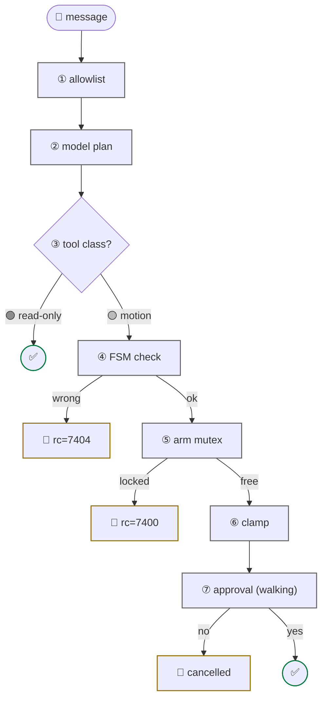

# safety model

<span class="read-badge">90s</span>

Seven gates between a user message and a motor torque. Any one refuses → the
motor stays idle.



| # | gate | what it does |
|:-:|---|---|
| 1 | **allowlist** | Telegram IDs/usernames not in `TELEGRAM_ALLOWED_USERS` dropped before the model sees them |
| 2 | **model plan** | prompt rules: never auto-walk, always release arm, verify after transitions |
| 3 | **tool class** | `G1_SAFE_TOOLS` omits walking → model literally can't call it |
| 4 | **FSM check** | motion needs `{500,501,801}` (arm) / `{501,801}` (walk); else `rc=7404`/`7302` |
| 5 | **arm mutex** | `rt/armsdk` single-writer lock; foreign writer → `rc=7400` |
| 6 | **clamp** | `duration ∈ [0,10]s`; velocity ranges documented, kept small |
| 7 | **approval** | `g1_walk_*` requires explicit user "yes" |

## unsafe publishes

Any raw publish to `rt/*cmd` needs `unsafe=True`:

```python
g1_dds_publish(topic="rt/lowcmd", payload={...}, unsafe=True)   # mandatory
```

The flag forces intent — the LLM can't publish motor commands by accident.

## emergency stop — always safe

```python
g1_stop_move()     # vx=vy=vyaw=0, any FSM
g1_set_fsm(1)      # Damp — soft-hold current pose
# Ctrl-C in REPL   # drops agent, motors stay put
```

!!! danger "Never FSM 0 (ZeroTorque)"
    Drops all torque — the robot collapses. Only safe on a gantry. The prompt
    forbids it unless your message contains the word "gantry".

## audit trail

```bash
tail -f /tmp/devduck/logs/devduck.log | grep -E '(rc=|g1_)'
```

Every call logs timestamp, tool, params, rc.


---

[FSM + errors](../reference/fsm.md){ .md-button } [architecture](architecture.md){ .md-button }
