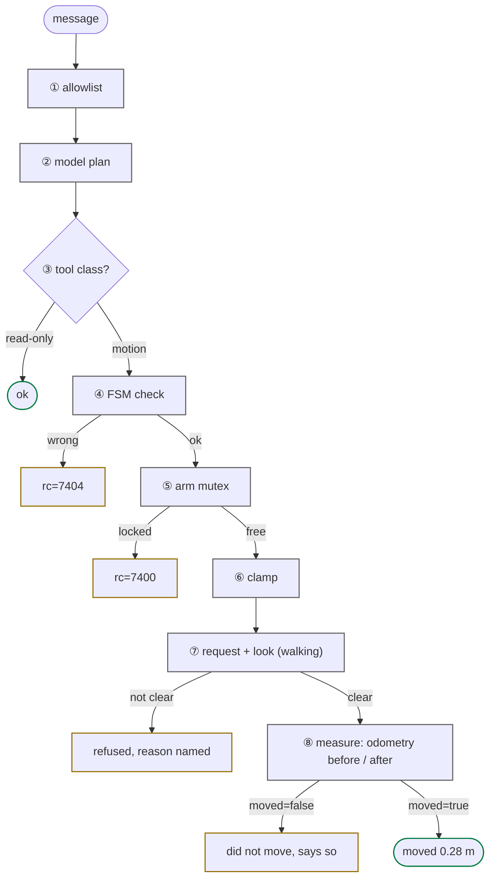

# safety model

<span class="read-badge">90s</span>

Eight gates between a user message and a motor torque. Any one refuses and the
motor stays idle; the eighth makes the robot tell the truth about what happened.



| # | gate | what it does |
|:-:|---|---|
| 1 | **allowlist** | Telegram IDs/usernames not in `TELEGRAM_ALLOWED_USERS` dropped before the model sees them |
| 2 | **model plan** | `prompts/base.md`: never walk uninvited or as a gesture, never `continuous=True`, never claim what the tool did not confirm |
| 3 | **tool class** | `G1_SAFE_TOOLS` omits walking and motion generation; `neon-mcp --safe` serves it, so a remote MCP client cannot walk the robot (the on-robot personas can) |
| 4 | **FSM check** | motion needs `{500,501,801}` (arm) / `{501,801}` (walk); else `rc=7404`/`7302` |
| 5 | **arm mutex** | `rt/armsdk` single-writer lock; foreign writer → `rc=7400` |
| 6 | **clamp** | duration 0 to 10 s, distance 0.1 to 1.0 m per request, speed 0.05 to 0.5 m/s, yaw rate 0.1 to 0.6 rad/s ([table](../tools/composed.md)) |
| 7 | **request + look** | an explicit request to walk or turn is the consent, nothing else is; the agent looks first with `take_photo`, walks only in FSM 501, and a refusal names the reason |
| 8 | **honesty** | the walking tools read `rt/odommodestate` before and after and return `moved=true` with the metres or `moved=false`; "done" is allowed only on `moved=true` |

## unsafe publishes

A raw publish to the five motor, BMS and hand topics needs `unsafe=True`
(`g1_dds_publish(topic="rt/lowcmd", payload={...}, unsafe=True)`); the flag
forces intent. Details on [use_dds](../tools/use-dds.md).

## emergency stop, always safe

```python
g1_stop_move()     # vx=vy=vyaw=0, any FSM
g1_set_fsm(1)      # Damp — soft-hold current pose
# Ctrl-C in REPL   # drops agent, motors stay put
```

!!! danger "Never FSM 0 (ZeroTorque)"
    Drops all torque and the robot collapses. Only safe on a gantry. There is
    no dedicated tool for it; `g1_set_fsm(0)` and `use_unitree("loco", ...)`
    can still reach it, which is why `use_unitree` flags `ZeroTorque`,
    `SetFsmId`, `SetVelocity`, `Move`, `WaveHand`, `ShakeHand` and
    `ReleaseMode` as high danger in its reply, and why `kimodo(action="play")`
    is a dry run unless you pass `confirm=True` and `on_gantry=True`.

## audit trail

Every tool call from every persona is wrapped by `tools/tool_log.py`: one line
on stderr (`journalctl -u neon-voice -f`, `docker compose logs -f`) and one
`tool` row in `agent_log` (`.memory/mem.db`) with tool, status, `rc`, duration,
arguments and, for walks, `moved` and `measured_m`. The dashboard activity log
shows the same rows: a spoken "done" can be checked against them.

```bash
make log-show                 # last 30 turns across personas
journalctl -u neon-voice -f | grep -E 'tool='
```


---

[FSM + errors](../reference/fsm.md){ .md-button } [architecture](architecture.md){ .md-button }
