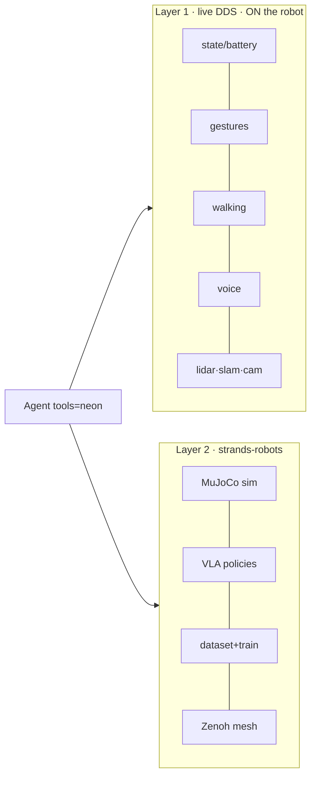

# strands-robots integration

<span class="read-badge">90s</span>

NEON drives the G1 through **two control layers**, fused by `neon()` into one
agent toolset.

| you call | what drives NEON |
|---|---|
| `Robot("g1")` | **simulation** (MuJoCo, CPU) — safe, no hardware |
| `Robot("g1", mode="real", robot_ip=...)` | joints via **LeRobot** `unitree_g1` driver, running a **policy** |
| `tools/` DDS tools | the **live controller** over CycloneDDS — FSM-gated, real-time |
| `neon()` | **both**, in one agent |

!!! note "DDS ≠ LeRobot path"
    `Robot(mode="real")` streams joint targets from a VLA policy via LeRobot — it
    does **not** route through the DDS tools. The DDS tools are a separate
    live-control layer (FSM gates, arm mutex, chest speaker). `neon()` gives the
    agent both: **DDS for presence/gestures/walking, `Robot()` for
    sim/policy/dataset/mesh.**

## two layers



## usage

```python
from strands import Agent
from neon import neon

Agent(tools=neon(mode="sim"))("create a world with the g1, run mock policy 30 steps")
Agent(tools=neon(mode="real", robot_ip="192.168.123.161"))("wave, then walk 0.3 m")
```

`Robot("g1")` and `Robot("neon")` both resolve to the upstream `unitree_g1`
(46-DOF) — no new assets downloaded.

## `neon()` knobs

| arg | default | effect |
|---|---|---|
| `mode` | `sim` | `sim` / `real` / `auto` |
| `dds` | `True` | live DDS tools |
| `locomotion` | `True` | walking tools |
| `lookout` | `True` | memory/voice/telegram/dispatch/vision |
| `robot_tool` | `True` | the strands-robots `Robot` tool |
| `mesh` | `None` | Zenoh fleet mesh (`STRANDS_MESH` env) |

## install

```bash
pip install -e ".[sim]"     # sim + policy layer
pip install -e ".[all]"     # + voice + lerobot + mesh
make sdk && pip install -e ".[robot]"   # on the robot (aarch64)
```

`strands-robots` is pulled from source; pip users:
`pip install git+https://github.com/strands-labs/robots.git`.


---

[architecture](architecture.md){ .md-button } [catalog](../tools/catalog.md){ .md-button }
