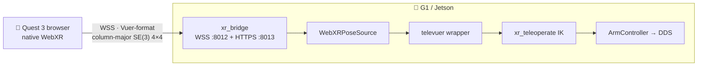

# WebXR teleop (Quest 3)

<span class="read-badge">90s</span>

Teleoperate the G1 **straight from the Quest 3 browser** — no APK, no sideload.
A WebXR page tracks your hands/controllers/head and streams poses to a bridge on
the robot, which runs IK and publishes to the arm controller over DDS.

!!! tip "Open the live page"
    With the bridge running, point the Quest browser at **`https://<robot-ip>:8013/`**
    ([`docs/teleop/index.html`](/neon-the-g1/teleop/)).

## architecture



**Why it works without Vuer:** the WebXR API returns each pose as a column-major
`Float32Array(16)` in the OpenXR basis — *exactly* what Unitree's `televuer`
consumes. We emit the identical wire format, so the upstream transform + IK run
**unchanged**. We just swap the transport: native WebXR-over-WSS.

## you need

| | |
|---|---|
| 🥽 | Quest 3 / Pro / 3S — hand-tracking enabled |
| 🤖 | G1 (29/23 DoF) reachable over DDS (`eth0`, `192.168.123.x`) |
| 🌐 | Quest + robot on the same LAN |
| 🔐 | TLS cert (WebXR needs a secure context) — `make xr-cert` |

## robot camera in-headset (downlink)

The page pulls the G1's binocular head cam over WebRTC from Unitree's
**teleimager** (`/offer`, port `60001`, side-by-side stereo 480×1280) and renders
each half to one eye — stereo parallax for free.

| mode | you see |
|---|---|
| **Immersive VR** | robot's stereo first-person view fills the headset |
| **AR passthrough** | robot view floats as a panel in your room |

Paste teleimager's `/offer` URL (auto-filled to `https://<host>:60001/offer`).
**📹 Test robot camera** shows a 2D preview before you enter XR.

## setup

```bash
# 1 · IK/robot stack on the robot (reuses Unitree's xr_teleoperate):
git clone --recurse-submodules https://github.com/unitreerobotics/xr_teleoperate
pip install -r xr_teleoperate/requirements.txt
pip install -e xr_teleoperate/teleop/televuer
pip install -e xr_teleoperate/teleop/robot_control/dex-retargeting
export PYTHONPATH="$PWD/xr_teleoperate:$PWD/xr_teleoperate/teleop/televuer/src:$PYTHONPATH"
pip install -r requirements-teleop.txt

# 2 · cert (secure context)
make xr-cert

# 3 · start the bridge
make xr-teleop-dry                          # verify headset stream, NO robot
make xr-teleop ARM=G1_29 IFACE=eth0         # live — IK + DDS (hand tracking)
# controllers + walking:
python -m neon.teleop.xr_bridge --input-mode controller --motion --network-interface eth0
```

## on the Quest

1. Quest Browser → `https://<robot-ip>:8013/`, accept the cert once.
2. Pick input (hand/controller) + send rate (30–90 Hz).
3. **▶ Enter XR & Teleop**, grant tracking.
4. Wrist poses drive the arms; **pinch** (hands) / **trigger** (controllers) = gripper.

## wire format

Three JSON message types over WS: `HAND_MOVE` (25 joints × 16 floats/hand +
pinch state), `CONTROLLER_MOVE` (16-float grip + buttons/axes), `CAMERA_MOVE`
(head matrix). `WebXRPoseSource` decodes them into the exact surface
`televuer.TeleVuer` exposes, so IK runs as-is.

## safety

- Control loop starts only after the first valid motion frame.
- Arm speed ramps gradually — no jump on connect.
- **No walking by default** — opt-in (`--motion`), clamped ±0.3, right-**A = stop**.
- FSM gating + arm mutex + battery refusal inherited from the DDS layer.
- Keep clear. Have an e-stop ready.

## troubleshooting

| symptom | fix |
|---|---|
| "WebXR not available" | use Quest Browser over HTTPS |
| bridge dot grey | open `https://<ip>:8013` first, accept cert |
| hands not tracked | enable hand tracking in Settings; grant permission |
| arms don't move (poses shown) | IK stack not on `PYTHONPATH`, or DDS down |
| jittery | lower send rate to 30 Hz; check Wi-Fi RSSI |


---

[safety model](safety.md){ .md-button } [architecture](architecture.md){ .md-button }
