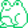
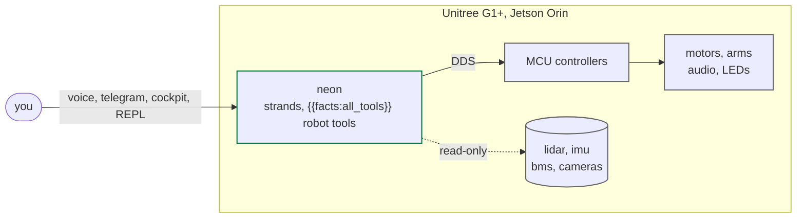

---
hide:
  - navigation
  - toc
---

neon

a strands agent on the unitree g1+, running on the robot

[:material-rocket-launch: 3-minute tour](start/quickstart.md){ .md-button .md-button--primary }
[:material-github: GitHub](https://github.com/cagataycali/neon-the-g1){ .md-button }

 <strong>&nbsp;live on G1</strong>
<strong>{{facts:all_tools}}</strong> robot tools
<strong>500 Hz</strong> state
<strong>29</strong> motors
<strong>8</strong> safety gates

neon&nbsp;&gt; wave hello and tell me what you see
  → g1_arm_action('high wave')     rc=0, released
  → take_photo('what do you see?') 640x480 via the dashboard
neon&nbsp;&gt; Waved. A person at a desk, laptop open.

<figure class="shot sr-wide" markdown>

<figcaption>the cockpit at neon.cagatay.my, live from the G1 (camera frame blurred for the people in the office). <a href="guide/dashboard/">more views</a></figcaption>
</figure>

---

## the whole thing in 3 minutes

1
**What it is.** A [Strands](https://github.com/strands-agents) agent that drives a
**Unitree G1+** humanoid. It runs **on the robot's Jetson**, speaks DDS to the
motor bus, and turns the SDK into {{facts:all_tools}} typed, safety-gated tools.
The model is remote (Bedrock or OpenAI Realtime); everything that touches a
motor is local.

2
**How you talk to it.** One agent, many faces: the chest speaker, Telegram, the
[cockpit](guide/dashboard.md) in a browser or on your phone, the REPL over SSH,
and a thinker that reflects every 30 s. Say `wave`, `walk forward 30cm`,
`what do you see?`, `map this room`. Every persona shares one memory and one log.

3
**Why it's safe.** Walking is FSM-gated and only on your explicit request; the
arm bus is mutex-locked; raw motor publishes need `unsafe=True`. After a walk
the robot measures its own displacement and says "done" only when it moved.

[Start the tour →](start/quickstart.md){ .md-button .md-button--primary }

## at a glance

| | |
|---|---|
| **robot** | Unitree G1+, 29 motors, 2 arms, Livox MID-360 lidar, RealSense + Brio cameras |
| **compute** | Jetson Orin NX, the agent runs on the robot |
| **transport** | CycloneDDS over `eth0` (no ROS) |
| **tools** | {{facts:all_tools}} robot tools + {{facts:lookout_tools}} cross-persona tools, counted from the code at build time |
| **model** | any Bedrock model id (`NEON_MODEL_ID`, default `{{facts:default_model}}`), changed live from the cockpit; voice on OpenAI Realtime, Nova Sonic or Gemini Live |
| **surfaces** | voice (chest speaker), Telegram, cockpit (browser, phone, tiny app), REPL, thinker |
| **safety** | [eight gates](guide/safety.md): allowlist, prompt, tool class, FSM, arm mutex, clamps, request + look, measured motion |

## the recommended path

-   :material-numeric-1-circle:{ .lg } **[Run it](start/quickstart.md)**: clone, add a Bedrock key, wave hello. 60 s.

-   :material-numeric-2-circle:{ .lg } **[See it](showcase/gestures.md)**: gestures, a measured walk, a Telegram message end to end.

-   :material-numeric-3-circle:{ .lg } **[Do it](recipes/index.md)**: recipes you can say: wave, walk, look, map, text.

-   :material-numeric-4-circle:{ .lg } **[Operate it](guide/dashboard.md)**: the cockpit, voice snooze, model switch, passkeys.

-   :material-numeric-5-circle:{ .lg } **[Dig in](tools/catalog.md)**: {{facts:all_tools}} tools, `use_unitree`, `use_dds`, the eight gates, the runtime.

---

  
  built with <a href="https://github.com/strands-agents">strands-agents</a>,
  <a href="https://github.com/cagataycali/devduck">devduck</a>,
  <a href="https://github.com/unitreerobotics/unitree_sdk2_python">unitree_sdk2</a>

