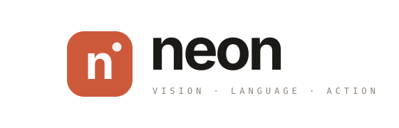
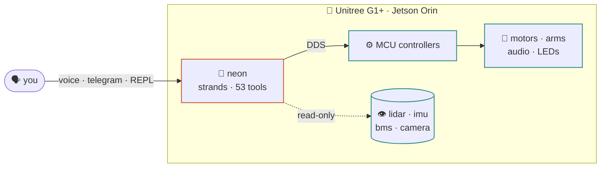

---
hide:
  - navigation
  - toc
---

a strands agent on the unitree g1+ · on the edge

[:material-rocket-launch: 3-minute tour](start/quickstart.md){ .md-button .md-button--primary }
[:material-github: GitHub](https://github.com/cagataycali/neon-the-g1){ .md-button }

 <strong>&nbsp;live on G1</strong>
<strong>53</strong> tools
<strong>500 Hz</strong> state
<strong>29</strong> motors
<strong>0</strong> cloud hops

neon&nbsp;&gt; wave hello and tell me what you see
  → g1_arm_action('high wave')     rc=0 · released
  → use_camera(source='realsense') rc=0 · 640×480
neon&nbsp;&gt; Waved 👋 — I see a person at a desk.

---

## the whole thing in 3 minutes

1
**What it is.** A [Strands](https://github.com/strands-agents) agent that drives a
**Unitree G1+** humanoid. It runs **on the robot's Jetson**, speaks DDS to the
motor bus, and turns every SDK call into a typed, safety-gated tool.

2
**How you talk to it.** One agent, four faces — REPL, voice, Telegram, dispatch.
Say `wave`, `walk forward 30cm`, `what do you see?`, `map this room`. It plans,
batches tool calls, and replies.

3
**Why it's safe.** Walking and posture are FSM-gated. The arm bus is mutex-locked.
Raw motor publishes need `unsafe=True`. The robot refuses what it shouldn't do.

[Start the tour →](start/quickstart.md){ .md-button .md-button--primary }

## at a glance

| | |
|---|---|
| **robot** | Unitree G1+ · 29 motors · 2 arms · Livox MID-360 lidar |
| **compute** | Jetson Orin NX — agent runs *on the robot* |
| **transport** | CycloneDDS over `eth0` (no ROS) |
| **tools** | 53 — state · posture · arm · audio · lidar · SLAM · DDS · vision |
| **models** | Bedrock (default: Claude Opus) via `NEON_MODEL_ID` |
| **surfaces** | REPL · voice (chest speaker) · Telegram · dispatch |
| **safety** | FSM gating · arm mutex · velocity clamps · `unsafe=True` for raw publishes |

## the recommended path

-   :material-numeric-1-circle:{ .lg } **[Run it](start/quickstart.md)** — clone, pick a model, wave hello. 60s.

-   :material-numeric-2-circle:{ .lg } **[See it](showcase/gestures.md)** — gestures, locomotion, the full request→motion pipeline.

-   :material-numeric-3-circle:{ .lg } **[Do it](recipes/index.md)** — copy-paste recipes: wave, walk, perceive, map, telegram.

-   :material-numeric-4-circle:{ .lg } **[Dig in](tools/catalog.md)** — 53 tools, `use_unitree`, `use_dds`, safety, architecture.

??? abstract "everything else"
    **Start** · [docker](start/docker.md) · [systemd](start/systemd.md) 
    **Tools** · [catalog](tools/catalog.md) · [use_unitree](tools/use-unitree.md) · [use_dds](tools/use-dds.md) · [composed](tools/composed.md) · [sensing](tools/sensing.md) 
    **Guide** · [safety](guide/safety.md) · [architecture](guide/architecture.md) · [troubleshooting](guide/troubleshooting.md) · [cli](guide/cli.md) · [extending](guide/extending.md) · [strands-robots](guide/strands-robots.md) · [WebXR teleop](guide/webxr-teleop.md) · [voice](voice-architecture.md) 
    **Reference** · [FSM + errors](reference/fsm.md) · [DDS topics](reference/dds-topics.md) · [joints](reference/joints.md) · [network](reference/network.md)

---

  
  built with <a href="https://github.com/strands-agents">strands-agents</a> ·
  <a href="https://github.com/cagataycali/devduck">devduck</a> ·
  <a href="https://github.com/unitreerobotics/unitree_sdk2_python">unitree_sdk2</a>

