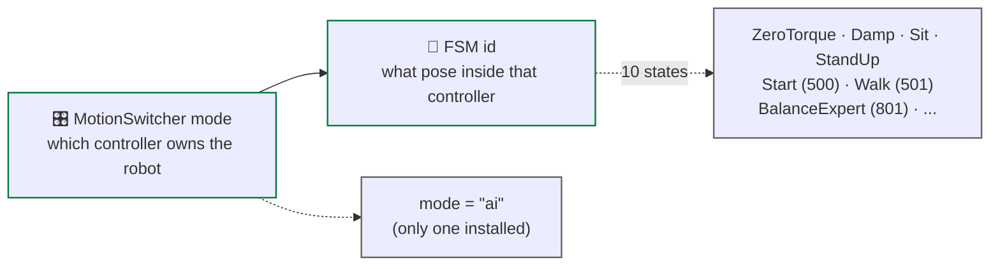
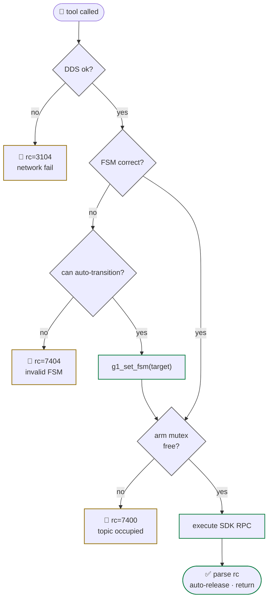

# FSM + error codes

<span class="read-badge">⏱ 60s · ref</span>

Two independent switches own the robot's motors. **Both must be right** before
anything moves.

## MotionSwitcher mode vs FSM id



`mode="ai"` alone is NOT enough — the FSM also has to be in the right state for
the action you want.

## FSM table

| id | Name | Enter safely? | Arm works? | Walking works? |
|:---:|---|:---:|:---:|:---:|
| 0 | ZeroTorque | 🔴 only on gantry | no | no |
| 1 | Damp | 🟢 always safe (soft limp) | no | no |
| 2 | Squat | 🟡 from stand | no | no |
| 3 | Sit | 🟡 from stand | no | no |
| 4 | StandUp | 🟡 from sit | no | no |
| **500** | Start (balance) | 🟢 default ready | ✅ yes | no |
| **501** | Walk | 🟡 mandatory for walk | ✅ yes | ✅ yes |
| **801** | BalanceExpert | 🟡 advanced | ✅ yes | partial |
| 702 | Lie2StandUp | 🟡 from face-up | no | no |
| 706 | Squat2StandUp | 🟡 from squat | no | no |

**`HANDSHAKE_FSMS = {500, 501, 801}`** — the set in which arm actions work.

## error code cheat sheet

| rc | meaning | fix |
|:---:|---|---|
| 0 | OK | — |
| **3104** | RPC timeout | check `network_interface="eth0"`, `CYCLONEDDS_URI` |
| **7301** | LocoState not available | controller not running, wait + retry |
| **7302** | walking blocked | FSM not 501/801, call `g1_set_fsm(501)` |
| **7400** | `rt/armsdk` occupied | another writer — never parallelize arm calls |
| **7401** | Arm holding | call `g1_release_arm()` |
| **7402** | Invalid action id | see `g1_list_arm_actions()` |
| **7404** | Invalid FSM for arm | call `g1_set_fsm(500)` → 500 |

## arm action ids

```
11  two-hand kiss     12  left kiss       13  right kiss
15  hands up          17  clap            18  high five
19  hug               20  heart           21  right heart
22  reject            23  right hand up   24  x-ray
25  face wave         26  high wave       27  shake hand
99  release           ← always follow actions with this
```

## decision flow before motion



## recovery recipes

- **rc 7400** after a crashed prior call → `g1_release_arm()` then retry
- **rc 7401** (arm holding) → `g1_release_arm()`
- **rc 7302** walking blocked → `g1_set_fsm(501)` then retry
- **rc 7404** arm wants 500 but you're in 1 (Damp) → `g1_set_fsm(500)` first
- **rc 3104** timeout → check ethernet, `ip link show eth0`, ping robot
