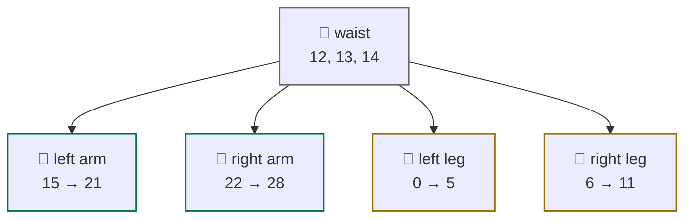

# joints

<span class="read-badge">60s · ref</span>

G1+ has **29 motor joints** plus optional **Inspire hand joints** (6 per hand).
Every index below is confirmed against `tools/g1_joints.py` (mirrors the SDK
`G1JointIndex`) and the live `rt/lowstate`.

## pose map



!!! note "No head motors"
    The 29-DoF G1 has no head/neck joints — head LED + orientation are handled
    by the audio/VUI service, not the motor bus. Indices 22–28 are the right arm.

## full index (`g1_joint_reference`)

> Names are **PascalCase** exactly as returned by `g1_joint_reference()` /
> `g1_joint_name()`. `g1_joint_index()` is case-insensitive on lookup but
> canonical form is PascalCase. Kp/Kd are the SDK low-level recommended gains
> (from `tools/g1_joints.py::KP_RECOMMENDED` / `KD_RECOMMENDED`).

### legs (0–11)

| idx | name | Kp | Kd |
|:---:|---|:---:|:---:|
| 0 | `LeftHipPitch` | 60 | 1 |
| 1 | `LeftHipRoll` | 60 | 1 |
| 2 | `LeftHipYaw` | 60 | 1 |
| 3 | `LeftKnee` | 100 | 2 |
| 4 | `LeftAnklePitch` | 40 | 1 |
| 5 | `LeftAnkleRoll` | 40 | 1 |
| 6 | `RightHipPitch` | 60 | 1 |
| 7 | `RightHipRoll` | 60 | 1 |
| 8 | `RightHipYaw` | 60 | 1 |
| 9 | `RightKnee` | 100 | 2 |
| 10 | `RightAnklePitch` | 40 | 1 |
| 11 | `RightAnkleRoll` | 40 | 1 |

### waist (12–14)

| idx | name | Kp | Kd | note |
|:---:|---|:---:|:---:|---|
| 12 | `WaistYaw` | 60 | 1 | |
| 13 | `WaistRoll` | 40 | 1 | invalid on 23dof/29dof w/ waist locked |
| 14 | `WaistPitch` | 40 | 1 | invalid on 23dof/29dof w/ waist locked |

### arms (15–28)

| idx | name | Kp | Kd | note |
|:---:|---|:---:|:---:|---|
| 15 | `LeftShoulderPitch` | 40 | 1 | |
| 16 | `LeftShoulderRoll` | 40 | 1 | |
| 17 | `LeftShoulderYaw` | 40 | 1 | |
| 18 | `LeftElbow` | 40 | 1 | |
| 19 | `LeftWristRoll` | 40 | 1 | |
| 20 | `LeftWristPitch` | 40 | 1 | invalid on 23dof |
| 21 | `LeftWristYaw` | 40 | 1 | invalid on 23dof |
| 22 | `RightShoulderPitch` | 40 | 1 | |
| 23 | `RightShoulderRoll` | 40 | 1 | |
| 24 | `RightShoulderYaw` | 40 | 1 | |
| 25 | `RightElbow` | 40 | 1 | |
| 26 | `RightWristRoll` | 40 | 1 | |
| 27 | `RightWristPitch` | 40 | 1 | invalid on 23dof |
| 28 | `RightWristYaw` | 40 | 1 | invalid on 23dof |

## helpers

```python
from tools import g1_joint_name, g1_joint_index, g1_joint_reference

g1_joint_index("LeftElbow")   # → 18  (case-insensitive: "leftelbow" also works)
g1_joint_name(25)             # → {"index":25,"name":"RightElbow","group":"right_arm",...}
g1_joint_reference()          # → full 29-joint table as JSON
g1_joint_reference(group="left_arm")   # → filter by group
```

## reading live values

`g1_read_lowstate()` returns a **summary** dict (not raw per-motor arrays):
`imu_rpy`, `legs` (L/R hip_pitch + knee + avg_knee), `posture`,
`max_leg_tau`, `mode_machine`, `mode_pr`, `tick`.

```python
from tools import g1_read_lowstate
s = g1_read_lowstate()
print(s["posture"])        # STANDING | SQUATTING / BENT | SITTING / DEEP_SQUAT
print(s["legs"])           # {"L_hip_pitch":..,"L_knee":..,"avg_knee":..}
print(s["imu_rpy"])        # [roll, pitch, yaw]
print(s["max_leg_tau"])    # peak |tau_est| across the 12 leg motors
```

> For raw per-joint `q/dq/tau/temperature` across all 29 motors, subscribe to
> `rt/lowstate` directly via `g1_dds` and read `motor_state[i]`.

## Inspire hand joints (optional)

If the Inspire hands are fitted, 6 joints per hand on `rt/inspire/state`:

| local idx | finger |
|:---:|---|
| 0 | thumb (bend) |
| 1 | thumb (rotation) |
| 2 | index |
| 3 | middle |
| 4 | ring |
| 5 | pinky |

Range: each uint16 0-1000. 0 = closed, 1000 = open.
