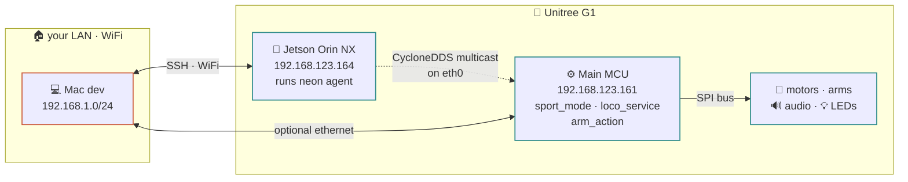

# network

<span class="read-badge">⏱ 45s · ref</span>

Where `neon`, the MCU, and your laptop all sit.

## topology



## address plan

| host | iface | ip | role |
|---|---|---|---|
| Jetson | `eth0` | `192.168.123.164/24` | our agent runs here |
| MCU | `eth0` | `192.168.123.161/24` | Unitree embedded — no SSH |
| Jetson | `wlan0` | DHCP on your LAN | optional WiFi for remote control |
| your Mac | `en0` / `en5` | WiFi or static `192.168.123.100` via USB-C → RJ45 | dev machine |

**Always use `network_interface="eth0"` in tools.** It's the only interface
that sees the motor bus.

## connecting

### SSH in

```bash
ssh unitree@192.168.123.164            # over ethernet (static route)
```

Default password: `123` (yes really).

### change IP / move to WiFi

See `scripts/change-ip.txt` in the repo for the exact steps. Or manually:

```bash
ssh unitree@192.168.123.164
sudo nmcli dev wifi connect "YourSSID" password "YourPassword"
```

Note the new IP from `hostname -I` and update your SSH target.

### mac ethernet setup (dev)

If you want to SSH from Mac over ethernet:

```
System Settings → Network → USB 10/100/1000 LAN →
  Configure IPv4: Manually
  IP:      192.168.123.100
  Subnet:  255.255.255.0
  Router:  (blank)
```

Don't assign `.161` or `.164` — those are the robot.

## CycloneDDS

```bash
cat /home/unitree/cyclonedds_ws/cyclonedds.xml
```

Key settings:

- `NetworkInterfaceAddress=eth0`
- `MaxMessageSize=65500`
- `Discovery ParticipantIndex=auto`

Our tools read this from `CYCLONEDDS_URI`. `env.sh` sets it.

## ports

Nothing exposed by default on the robot itself. When the compose stack runs:

| port | service |
|---|---|
| 8080 | neon-dashboard (HTTPS · FastAPI telemetry + camera + chat UI) |
| 8012 / 8013 | WebXR teleop bridge (WSS / HTTPS) — only when running |
| N/A | Telegram uses long-poll (no inbound port) |

## troubleshooting

| symptom | likely cause |
|---|---|
| all tools return `rc=3104` | `eth0` down, wrong interface, or `CYCLONEDDS_URI` missing |
| no DDS topics listed | robot main controller is off, or you're on wrong interface |
| can ping `.161` but can't SSH | correct — the MCU doesn't run sshd |
| SLAM / LiDAR silent | lidar not switched on; call `g1_lidar_switch(on=True)` |

```bash
# sanity checks
ip link show eth0                           # state UP?
ping -c 3 192.168.123.161                  # MCU reachable?
echo $CYCLONEDDS_URI                        # env set?
python3 -c "from tools import g1_get_state; print(g1_get_state())"
```
