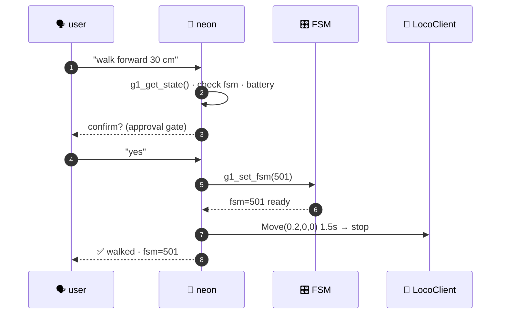

# locomotion

45s

Walking, turning, posture — **the dangerous stuff**. Every command needs
explicit user approval in the agent loop.

!!! danger "Robot can fall"
    Clear floor, operator within reach, ~500 ms stop latency. See [safety](../guide/safety.md).

| intent | call |
|---|---|
| walk 30 cm | `g1_walk_forward(distance=0.3, speed=0.2)` |
| turn 90° | `g1_turn(angle_rad=1.57, yaw_rate=0.4)` |
| strafe right | `g1_move_velocity(vx=0, vy=0.2, vyaw=0, duration=2)` |
| **stop** (safe) | `g1_stop_move()` |
| squat → stand | `g1_safe_squat_to_stand()` |
| lie → stand | `g1_safe_lie_to_stand()` |
| damp (safe) | `g1_set_fsm(1)` |

## voice-driven walking, live

Strands **bidirectional speech-to-speech** → `g1_move_velocity` → the G1 steps.
Spoken command in, motion out, in real time.

<figure style="flex:1;min-width:240px;margin:0;">
<video controls muted playsinline loop width="100%" style="border-radius:8px;">
  <source src="../../assets/move-forward.mp4" type="video/mp4">
</video>
<figcaption style="text-align:center;color:var(--muted);font-size:.85em;">walk forward</figcaption>
</figure>
<figure style="flex:1;min-width:240px;margin:0;">
<video controls muted playsinline loop width="100%" style="border-radius:8px;">
  <source src="../../assets/move-backwards.mp4" type="video/mp4">
</video>
<figcaption style="text-align:center;color:var(--muted);font-size:.85em;">walk backward</figcaption>
</figure>

## clamps

| axis | unit | safe range |
|---|---|---|
| `vx` | m/s | 0.1 – 0.3 |
| `vy` | m/s | ±0.1 – 0.2 |
| `vyaw` | rad/s | ±0.3 |
| `duration` | s | 0.1 – 10.0 (capped) |

Only `duration` is hard-clamped; velocities pass through — keep them small.

## a walk, start to finish

---

[safety model](../guide/safety.md){ .md-button } [gestures](gestures.md){ .md-button } [walk recipe](../recipes/walk.md){ .md-button }
