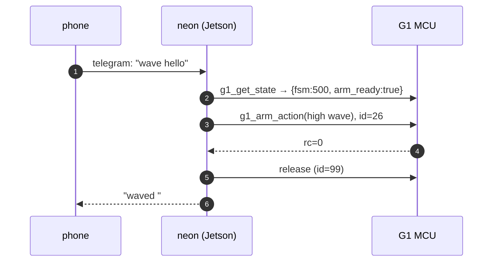

# end-to-end workflow

60s

What actually happens when you text `wave hello` from your phone.

**End-to-end: ~2-4 s**, dominated by Telegram long-poll and model planning;
the motor is the fastest part. Each call lands as a `tool` row in the activity
log, so "waved" can be checked against `rc=0`.

## parallel tool calls

"wave hello and tell me what you see" fans out into `g1_get_state`,
`g1_arm_action` and `take_photo` in one round-trip: no data dependencies.

## latency budget

| stage | typical |
|---|---:|
| telegram wake-up | 400-800 ms |
| model plan + calls | 600-2000 ms |
| `g1_get_state` | < 20 ms |
| `g1_arm_action` | 300-600 ms |
| `use_camera` | 40-100 ms |
| **total** | **~2-4 s** |

## model

NEON runs on a Bedrock model (`NEON_MODEL_ID`, default
`{{facts:default_model}}`). Point it at a lighter model id to trade quality
for latency: set it in `.env`, or from the dashboard (Configuration, model,
then "Apply to all personas"), which writes the same line and recreates the
persona containers through the host `neon-ctl` service.

## resilience

- Telegram down → REPL over SSH still works.
- DDS drops → tools return `rc=3104`, agent reports it.
- A persona crash → compose `restart: unless-stopped`; the MCU's `sport_mode` is a separate box.
- Model API fails → tools still run; only planning is offline.

---

[architecture](../guide/architecture.md){ .md-button } [catalog](../tools/catalog.md){ .md-button }
