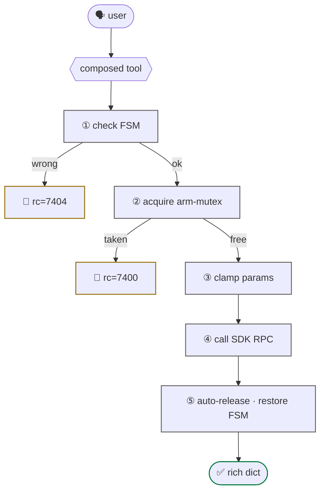

# composed (safety-gated)

<span class="read-badge">⏱ 60s</span>

The hand-written tools in `tools/g1_*.py` that do **more than a 1:1 SDK call** —
FSM gating, mutex, clamps, rich returns. They exist so the agent can't foot-gun.

> If a tool just wraps one SDK method and returns raw rc, it lives inside
> [`use_unitree`](use-unitree.md). Composed tools **do something the SDK doesn't.**

## real work they add

- **FSM auto-transition** — `g1_arm_action` flips to 500 if needed
- **Arm mutex** — `rt/armsdk` is single-writer; the tool holds a lock
- **Auto-release** — arm actions follow with id 99 (neutral)
- **Damp preamble** — `g1_safe_*` issue FSM 1 first to avoid jerks
- **Clamps** — `g1_move_velocity` caps `duration ∈ [0,10]s`; `g1_walk_forward`
  caps `distance ∈ [-1,1]m`, `speed ∈ [0.05,0.5]`; `g1_turn` caps `yaw_rate ∈ [0.1,0.6]`
- **Rich returns** — `g1_set_fsm` → `{before, after, rc, message}`
- **Frame parsing** — `g1_battery` decodes BMS frames

## the gate



## the list

| tool | why composed |
|---|---|
| `g1_arm_action` | FSM gate + mutex + auto-release + name→id |
| `g1_release_arm` | publishes id 99; frees arm |
| `g1_move_velocity` | duration cap + requires FSM 501 |
| `g1_walk_forward` | derives `duration` from `distance/speed` |
| `g1_turn` | `angle_rad` → timed `vyaw` |
| `g1_set_fsm` | rich return; logs before/after |
| `g1_safe_squat_to_stand` · `g1_safe_lie_to_stand` · `g1_safe_stand_to_squat` | Damp-first transitions |

## write your own

```python
from strands import tool
from ._g1_common import ensure_dds, get_loco_client, read_fsm_id, decode_code, HANDSHAKE_FSMS

@tool
def g1_do_thing(param: int = 0, network_interface: str = "eth0") -> dict:
    """One-line intent the LLM reads."""
    if err := ensure_dds(network_interface):
        return {"status": "error", "message": err}
    if read_fsm_id() not in HANDSHAKE_FSMS:
        return {"status": "error", "message": "wrong FSM"}
    rc = get_loco_client().DoThing(param)
    return {"status": "success" if rc == 0 else "error", "rc": rc, "message": decode_code(rc)}
```

Then export from `tools/__init__.py` into the right bundle. See [extending](../guide/extending.md).
