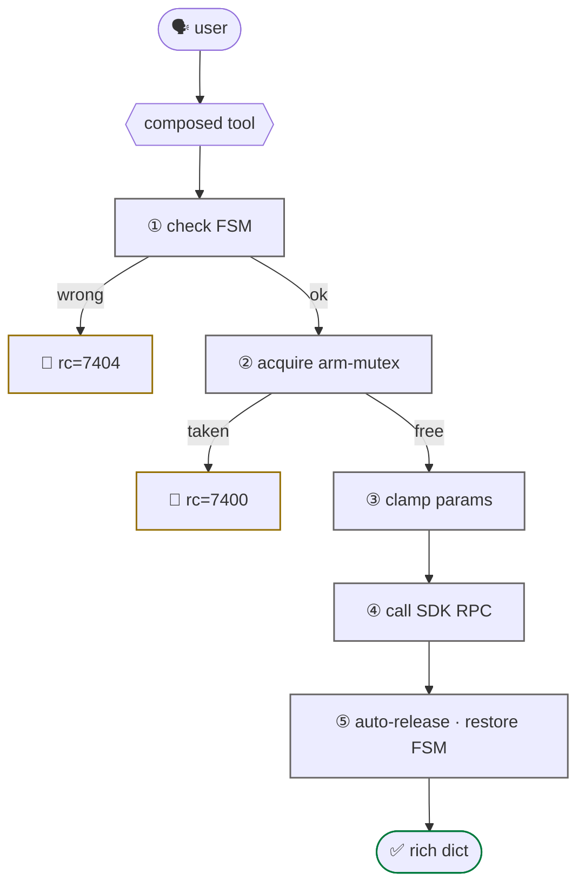

# composed (safety-gated)

60s

The hand-written tools in `tools/g1_*.py` that do **more than a 1:1 SDK call** —
FSM gating, mutex, clamps, rich returns. They exist so the agent can't foot-gun.

> If a tool just wraps one SDK method and returns raw rc, it lives inside
> [`use_unitree`](use-unitree.md). Composed tools **do something the SDK doesn't.**

## real work they add

- **FSM auto-transition** — `g1_arm_action` flips to 500 if needed
- **Arm mutex** — `rt/armsdk` is single-writer; the tool holds a lock
- **Auto-release** — arm actions follow with id 99 (neutral)
- **Damp preamble** — `g1_safe_*` issue FSM 1 first to avoid jerks
- **Clamps** — `g1_move_velocity` caps `duration` to 0 to 10 s; `g1_walk_forward`
  keeps `distance` between 0.1 and 1.0 m per request (below 0.1 m nothing
  visible happens) and `speed` between 0.05 and 0.5 m/s, at least 0.15 under
  0.3 m; `g1_turn` keeps `yaw_rate` between 0.1 and 0.6 rad/s
- **Measured motion** — the walking tools read `rt/odommodestate` before and
  0.5 s after the command and return `moved`, `requested_m`, `measured_m`
  (`measured_rad` for turns); `moved=false` is `rc=0` with no displacement
- **Rich returns** — `g1_set_fsm` → `{before, after, rc, message}`
- **Frame parsing** — `g1_battery` decodes BMS frames

## the gate

## the list

| tool | why composed |
|---|---|
| `g1_arm_action` | FSM gate + mutex + auto-release + name→id |
| `g1_release_arm` | publishes id 99; frees arm |
| `g1_move_velocity` | duration cap, requires FSM 501 or 801, measures displacement |
| `g1_walk_forward` | derives `duration` from `distance/speed`, clamps, measures |
| `g1_turn` | `angle_rad` → timed `vyaw`, measures the yaw change |
| `g1_set_fsm` | rich return; logs before/after |
| `g1_safe_squat_to_stand` · `g1_safe_lie_to_stand` · `g1_safe_stand_to_squat` | Damp-first transitions |

## write your own

The template (`ensure_dds`, FSM check, SDK call, decoded `rc`) lives on
[extending](../guide/extending.md#a-composed-tool), with the ToolResult shape
the tests check. Export it from `tools/__init__.py` into the right bundle and
the catalog counts follow.
