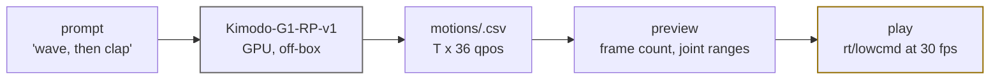

# motion generation

60s, danger

`kimodo` turns a sentence into a full-body motion clip and plays it on the G1.
It is the one tool that bypasses the onboard balance controller, so its gate is
stricter than walking.

## two phases, two machines

**Generate** needs CUDA and `pip install kimodo` (about 17 GB VRAM, 3 GB with
the text encoder on CPU). The Jetson has neither, so `kimodo(action="generate")`
posts the prompt to `KIMODO_ENDPOINT` (a workstation or a zenoh peer with a GPU)
and saves the CSV into `motions/`; when no endpoint answers it returns the exact
command to run elsewhere and the file to copy back.

**Play** runs on the robot: the 29 joint columns map one to one onto the SDK
motor index, streamed as `LowCmd_` on `rt/lowcmd` with PD gains, CRC and a ramp
from the current measured pose into frame 0.

## the gate

| call | what happens |
|---|---|
| `kimodo(action="list")` | the clips in `motions/` (rows, note) |
| `kimodo(action="preview", csv="kimodo_right_wave.csv")` | parses, reports frames and per-joint ranges; no motion |
| `kimodo(action="play", csv=...)` | **dry run**: validates and reports, nothing moves |
| `kimodo(action="play", csv=..., confirm=True, on_gantry=True)` | moves. Both flags, every time |
| `kimodo(action="stop")` | aborts a playback; the robot holds the last target, so damp it |

The clip bypasses `ai` balance: a leg or waist motion on the floor drops the
robot. `on_gantry=True` is you saying it is suspended. `kp_scale` / `kd_scale`
soften the gains, `max_frames` plays a slice. `motions/README.md` lists the
shipped clips and which are gantry-only.

## where it sits

`kimodo` is `G1_MOTION_GEN_TOOLS` in `tools/__init__.py`: part of `G1_ALL_TOOLS`
(telegram and thinker personas) and of the cross-persona list, **not** part of
`G1_SAFE_TOOLS`, so `neon-mcp --safe` never exposes it.

---

[catalog](catalog.md){ .md-button } [safety](../guide/safety.md){ .md-button }
